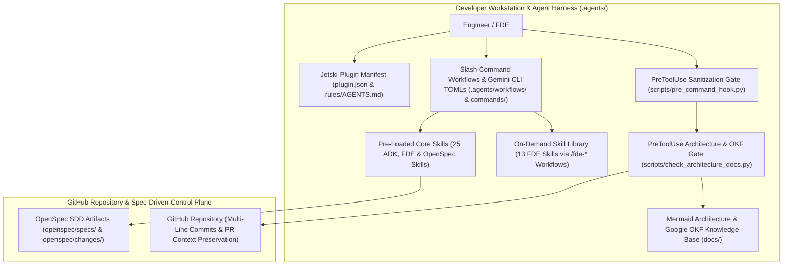

# System Architecture & Operational Knowledge Framework (OKF)

This document defines the canonical system architecture using **Mermaid** (`docs/architecture_diagram.mmd`) and links directly to the **Google Operational Knowledge Framework (OKF)** catalog in [`docs/knowledge_base/`](knowledge_base/README.md).

---

## 1. Canonical System Topology (Mermaid)

---

## 2. Architectural Pillars & Boundaries

1. **Developer Workstation & Agent Harness (`.agents/`)**:
   - **Two-Tier Skill Architecture**: 25 core pre-loaded skills (`skills/`) for Google ADK-Python, Cloud AI FDE production engineering, and OpenSpec Spec-Driven Development, paired with 13 on-demand skills (`skill-library/`) invoked explicitly via `/fde-*` workflows (`workflows/` and `.gemini/commands/`).
   - **Deterministic `PreToolUse` Gates (`hooks.json` & `scripts/`)**:
     - `git-push-sanitization-gate` (`scripts/pre_command_hook.py`): Blocks `git push` if cookies, JWTs, API keys, OAuth tokens (`ya29...`), GCP Service Account keys, AWS IAM keys, sensitive files, or internal Google references (`go/`, `b/`, `cl/`, `g3doc/`, `//depot/`) are detected.
     - `git-push-architecture-docs-gate` (`scripts/check_architecture_docs.py`): Ensures `docs/architecture.md`, `docs/architecture_diagram.mmd`, and `docs/knowledge_base/` are synchronized with outgoing commits.
2. **GitHub Repository & Spec-Driven Control Plane**:
   - Enforces OpenSpec Spec-Driven Development (`openspec/`), multi-line commit context (`Why` / `What` / `Verification`), and PR context preservation.

---

## 3. Google OKF Knowledge Base Links

- **OKF Specification**: [`docs/knowledge_base/OKF_SPEC.md`](knowledge_base/OKF_SPEC.md)
- **OKF Entry Template**: [`docs/knowledge_base/TEMPLATE.md`](knowledge_base/TEMPLATE.md)
- **OKF Catalog Index**: [`docs/knowledge_base/README.md`](knowledge_base/README.md)
- **FDE Agent Factory Plugin Entry**: [`docs/knowledge_base/cloudtop_env/fde-agent-factory-plugin.md`](knowledge_base/cloudtop_env/fde-agent-factory-plugin.md)
