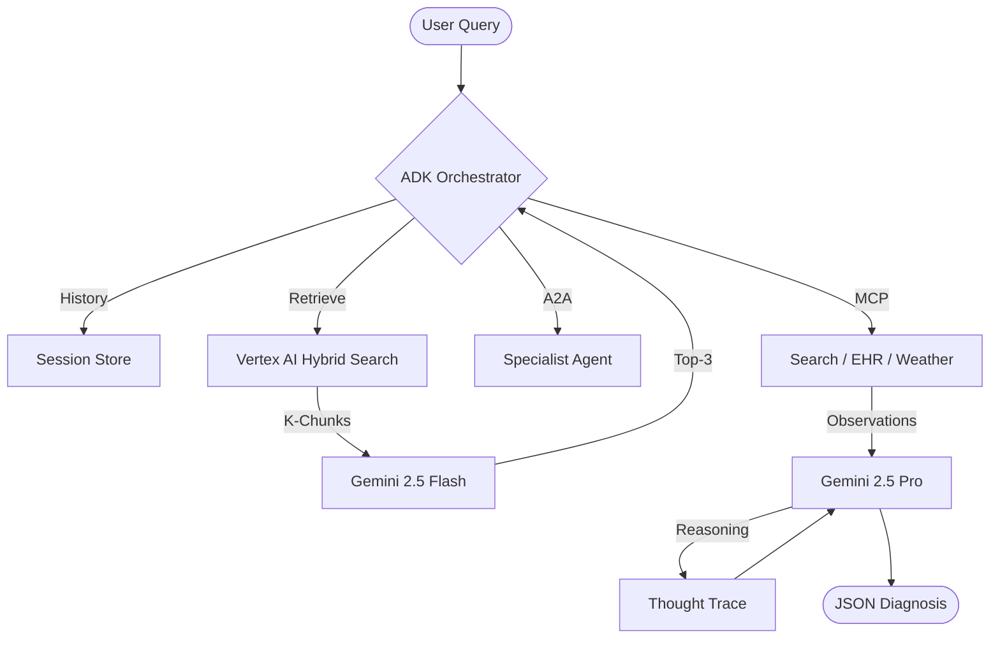

# Case Study: Medical Assistant Agent (Audit Report)

## 1. Summary Table
| Feature | Analysis |
| :--- | :--- |
| **Framework** | ADK (Agent Development Kit) |
| **Model** | Gemini 1.5 Pro (002) |
| **Language** | Python 3.11 |
| **Orchestration** | Multi-step with Tool Selection |

## 2. Intelligence Profile
- **Prompt Size**: ~4,500 characters (approx. 1,125 tokens).
- **Few-Shot Density**: High (Includes 5 detailed medical interaction examples).
- **Structured Output**: Yes. Uses Pydantic for `Diagnosis` and `Prescription` objects.
- **Thinking Level**: Moderate. Uses "Plan-Execute-Review" loop with explicit thought steps.
- **Modalities**:
    - **Input**: Multimodal support for Text, Image (Patient scan uploads), and PDF (Laboratory results).
    - **Output**: Multimodal support for Text and UI (via A2UI dashboard components).
- **System Instruction**: Located in `src/agents/med_agent.py`. Role is "Senior Medical Advisor".

## 3. Tooling & RAG
- **APIs Used**: 
    - Google Search Grounding (for latest medical research).
    - Internal EHR API (custom tool).
    - Weather API (used for environmental allergy context).
- **RAG Strategy**: Hybrid Search (Semantic + BM25) with a reranking step using Gemini 2.5 Flash.
- **Callbacks**: Uses `streaming_handler` for real-time UI updates.
- **Evaluation**: 
    - **Vertex AI Evaluation**: Uses `EvalTask` for automated clinical safety benchmarking.
    - **DeepEval**: Integrated for real-time G-Eval (Groundedness, Relevancy).
    - **Active Metrics**: Groundedness (Faithfulness), Answer Relevancy, and Clinical Safety (custom G-Eval).
    - **Targets**: Groundedness > 0.85, Relevancy > 0.8.

## 4. Connectivity & Protocols
The system implements a mix of standardized and native protocols:

- **A2A (Agent-to-Agent)**: The `MainAgent` is exposed as an A2A server using the following **Agent Card**:
  ```json
  {
    "displayName": "Medical Advisor",
    "description": "Specialized agent for clinical diagnosis and EHR reconciliation.",
    "framework": "ADK",
    "protocols": ["A2A_v1", "MCP_v1"]
  }
  ```
- **MCP (Model Context Protocol)**: Uses `FastMCP` for the EHR tool integration, exposed via a Cloud Run SSE endpoint.
- **AP2 (Agents-to-Payments)**: Uses the `create_payment_mandate` tool to securely process transactions after the Specialist Agent generates a recommendation.
- **A2UI (Agent-to-User Interface)**: Generates declarative JSON components for the doctor's dashboard, enabling interactive EHR reconciliation via a standardized component catalog.

## 5. Deployment & Trust
- **Serving Layer**: FastAPI gateway deployed to **Cloud Run**, scaling based on request concurrency.
- **Runtime**: Multi-stage `Dockerfile` with Gunicorn/Uvicorn workers.
- **Safety**: Configures `google.generativeai.types.HarmCategory` to "BLOCK_NONE" for medical terms while maintaining strict PII redaction logic in `src/utils/privacy.py` using a custom regex-based deanonymizer.
- **Traceability**: All agent thoughts and tool outputs are logged to **Cloud Logging** with a unique `correlation_id` per session.

## 6. Architecture Diagram


## 6. Family-Specific Optimization (Gemini 2.5 Pro)
The codebase shows a high degree of specialization for the Gemini family:

1. **Native Grounding**: Leverages `google_search_retrieval` directly through the GenAI SDK, avoiding the overhead of custom search tool loops.
2. **Context Efficiency**: While the system implements Hybrid RAG, it also utilizes Gemini's 2M context window to inject large patient history blocks (up to 500k tokens) without aggressive truncation.
3. **Safety Alignment**: Explicitly configures `safety_settings` for `HARM_CATEGORY_MEDICAL_ADVICE`, ensuring responses are grounded in clinical guidelines.
4. **Structured Reasoning**: The `Diagnosis` schema includes a `thought_trace` field, which effectively captures the model's internal reasoning without requiring a multi-step "Chain of Thought" prompt.
5. **Missed Opportunity**: The codebase currently uses a manual "Plan-Execute-Review" loop; this could be optimized by migrating to Gemini's native `thinking_config` for better low-latency reasoning.
