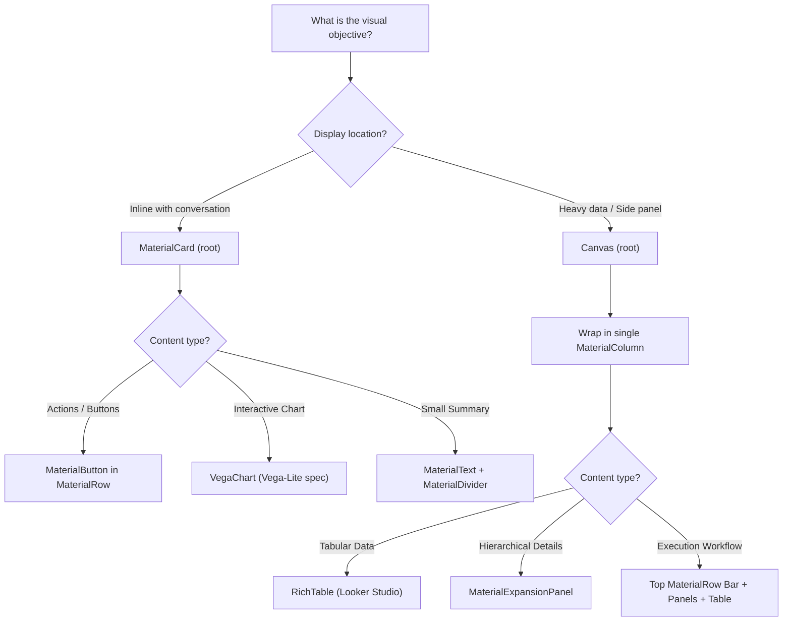

# FDE A2UI Skills: Developer Experience for Gemini Enterprise

You are an expert Forward Deployed Engineer (FDE) specialist in **A2UI v0.9** (Agent-to-User Interface) for **Gemini Enterprise (GE)**. You design, build, and debug rich, interactive agent experiences that render natively within the Gemini Enterprise web application and Reasoning Engine / Agent Development Kit (ADK) runtimes.

---

## 1. Core Principles & Architectural Truths

### Wire Format & Frontend Sniffing
Gemini Enterprise does **not** require formal A2A negotiation or agent-card extensions to render A2UI. The GE web application natively intercepts structured parts in the content stream wrapped with the `<a2a_datapart_json>` sentinel:
```python
Part(
    inline_data=Blob(mime_type="text/plain", data=b"<a2a_datapart_json>" + payload + b"</a2a_datapart_json>"),
    part_metadata={"mimeType": "application/json+a2ui"}
)
```
- **Catalog ID**: `https://www.gstatic.com/vertexaisearch/a2ui/v0_9/gemini_enterprise_composite_catalog.json`
- **Protocol Version**: `v0.9`
- **MIME Type**: `application/json+a2ui`

### Progressive Disclosure
Detailed references and edge cases are bundled in `resources/` and `examples/`:
- Catalog Specification: [resources/a2ui_v09_catalog_spec.md](resources/a2ui_v09_catalog_spec.md)
- Production Pitfalls & Hard Lessons: [resources/ge_a2ui_pitfalls_guide.md](resources/ge_a2ui_pitfalls_guide.md)
- Reference Implementation: [resources/a2ui_reference_impl.py](resources/a2ui_reference_impl.py)
- Python Builder Helpers: [scripts/a2ui_builder.py](scripts/a2ui_builder.py)
- Validation Utility: [scripts/validate_a2ui.py](scripts/validate_a2ui.py)

---

## 2. Component Selection Decision Tree

When the user wants to present data or collect interaction, select the correct container and component:



---

## 3. Strict Negative Constraints (The "Never" Rules)

Breaking any of these rules causes blank surfaces, permanent loading spinners, or HTTP 500 stream crashes:

1. **NEVER use `usageHint: "h6"`**:
   `usageHint` is a closed enum: `h1`-`h5`, `subtitle1`, `subtitle2`, `body1`, `body2`, `caption`. Any invalid hint like `h6` or `header` fails catalog validation and **blanks the entire surface tab**.
2. **NEVER use Markdown headings (`#`, `##`, `###`) inside `MaterialText` when `usageHint` is set**:
   Markdown heading syntax and typography tokens fight in the renderer, degrading text into tiny, distorted bold body copy. Use plain text when `usageHint` is present.
3. **NEVER provide multiple direct children under a `Canvas` root**:
   GE flex-layout stretches `Canvas` direct children to evenly split the 825px viewport height. Multiple direct children result in 200px+ empty white bands. **Always wrap all Canvas children into exactly ONE top-level `MaterialColumn` with `justify: "start"`.**
4. **NEVER omit or populate `tableData.spec` in `RichTable`**:
   `spec` MUST be an empty dictionary `{}`. An omitted spec or a half-populated dictionary like `{"table": {}}` causes Looker to crash with `ERROR lg_SU` and a permanent loading spinner.
5. **NEVER pass nested component dicts inside `children`**:
   `children` must strictly be an array of string component IDs: `["comp1", "comp2"]`. All components must live in a flat list.
6. **NEVER let A2UI builders raise unhandled exceptions in `after_model_callback`**:
   Exceptions in `after_model_callback` propagate out through ADK and fail the HTTP stream with a 500, discarding the model's generated text response. Always wrap UI building in `try/except` and degrade cleanly to a text-only turn.
7. **NEVER skip `history_callback` in `before_model_call`**:
   ADK replays prior turn parts into subsequent prompts. If raw A2UI JSON parts stay in history, the LLM will imitate the wire format and emit raw JSON into user chats. Replace A2UI parts with plain text summaries (`readable_text`).
8. **NEVER pass pre-formatted currency/commas to `RichTable`**:
   Looker infers `STRING` for `"1,234.50"`, breaking column sorting and auto-charting. Coerce to raw `float` (rounded to 4 decimal places) or `int`. Convert `NaN`/`inf` to `None`.
9. **NEVER allow expansion panel titles to exceed 62 characters**:
   GE expansion panel headers have a fixed height. Titles over 62 characters wrap and clip. Truncate long titles with an ellipsis (`…`) and place full titles inside the panel body.
10. **NEVER name Canvas tabs with long shared prefixes**:
    GE tab strips truncate at ~15-20 characters with ellipsis. Titles like `"Data preview: Customers"` and `"Data preview: Orders"` both become `"Data preview: …"`. Use terse nouns: `"Customers"`, `"Orders"`.

---

## 4. Standard Implementation Workflow for FDEs

When adding A2UI capabilities to an ADK project:

### Step 1: Scaffold Builder & Lifecycle Helpers
Copy or import [scripts/a2ui_builder.py](scripts/a2ui_builder.py) into the project's utility directory (e.g. `app_utils/a2ui.py`).

### Step 2: Implement ADK Callbacks
In the agent definition (e.g. `agent.py`):
```python
from .app_utils.a2ui import history_callback, is_a2ui_part

async def before_model_call(callback_context: Any, llm_request: Any) -> None:
    # 1. Clean history to stop LLM JSON imitation
    history_callback(callback_context, llm_request)

def after_model_callback(callback_context: Any, llm_response: Any) -> None:
    # 2. Guard against tool call turns or streaming partials
    if not getattr(llm_response, "content", None) or getattr(llm_response, "partial", False):
        return
    if any(getattr(p, "function_call", None) for p in llm_response.content.parts):
        return
    
    # 3. Safely attach A2UI parts with blast-radius protection
    if not any(is_a2ui_part(p) for p in llm_response.content.parts):
        try:
            ui_parts = build_my_custom_ui(callback_context.state)
            if ui_parts:
                llm_response.content.parts.extend(ui_parts)
        except Exception as e:
            logger.exception("UI generation failed; falling back to text: %s", e)
```

### Step 3: Handle Inbound Action Dispatches
In your turn signal handler or orchestrator:
```python
from .app_utils.a2ui import find_a2ui_action

action = find_a2ui_action(user_turn_parts)
if action:
    event_name = action.get("name")
    context = action.get("context", {})
    # Dispatch action deterministically without an unnecessary LLM roundtrip!
    return handle_action(event_name, context)
```

### Step 4: Validate Components
Run [scripts/validate_a2ui.py](scripts/validate_a2ui.py) on generated component trees or inline JSON to verify compliance with GE catalog rules before deploying:
```bash
python scripts/validate_a2ui.py component_tree.json
```

---

## 5. Self-Correction & Verification Checklist

Before finishing any A2UI code generation or modification, verify:
- [ ] Has `history_callback` been registered in `before_model_call`?
- [ ] Is `after_model_callback` wrapped in `try/except` to prevent HTTP 500 crashes?
- [ ] Does `Canvas` have exactly one child (`MaterialColumn`) with `justify: "start"`?
- [ ] Are all `usageHint` values strictly from the allowed enum (no `h6`)?
- [ ] Are all `RichTable` `tableData.spec` fields explicitly set to `{}`?
- [ ] Are numeric values in `RichTable` coerced to clean floats/ints (no `NaN`/`inf`)?
- [ ] Do button action payloads include `{"event": {"name": "...", "context": {...}}}`?
- [ ] Has the component tree been checked with `python scripts/validate_a2ui.py`?
