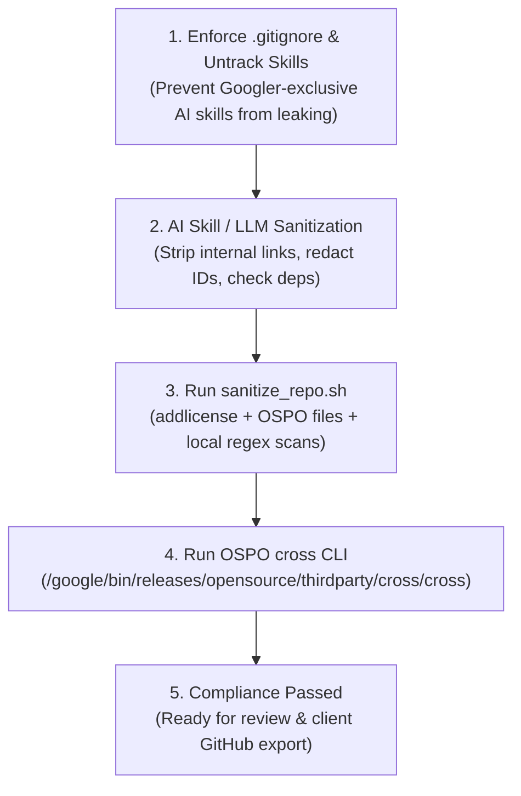

# Sanitize and Prepare Code for Client Delivery (`fde-cross-compliance`)

Prepares, audits, and sanitizes source code intended for external client handoff or open-source release in accordance with Google Forward Deployed Engineering (FDE) and Open Source Programs Office (OSPO) compliance standards.

## When to Use This Skill

Activate this skill (or invoke `/fde-cross-compliance`) whenever you need to:
- Prepare a repository or code snippet for external client delivery or GitHub export.
- Run or remediate findings from the OSPO `cross` CLI (`/google/bin/releases/opensource/thirdparty/cross/cross`).
- Exclude Googler-exclusive AI skills, prompts, and agent harnesses (`.gemini/`, `.agents/`, `skills/`, `clean-code-skill/`, `GEMINI.md`, `AGENTS.md`, etc.) from client git repositories via `.gitignore`.
- Strip internal Google shortlinks (`go/`, `b/`, `cl/`, `yaqs/`), internal depot paths (`google3/`, `piper://`), internal corporate domains (`g3doc`), or `@google.com` LDAPs/emails.
- Apply standard Apache 2.0 license headers across all source files using `addlicense`.
- Replace hardcoded GCP project IDs, bucket names, VPCs, or credentials with sanitized placeholders.

---

## Sanitization Workflow

Copy this checklist to track progress when sanitizing a repository:

```markdown
Sanitization Progress:
- [ ] Step 1: Enforce .gitignore for Googler-Exclusive AI Skills & Agent Files
- [ ] Step 2: Ensure OSPO Files (LICENSE, CONTRIBUTING.md, README.md) & Apply Apache 2.0 Headers
- [ ] Step 3: Remove Internal Google Links, Paths, Identities & Flagged Terms
- [ ] Step 4: Redact Credentials, Secrets & Hardcoded Environments
- [ ] Step 5: Verify Third-Party Dependency Licensing Cleanliness
- [ ] Step 6: Run Automated Compliance Scan (`sanitize_repo.sh` & `cross` CLI)
```

### Step 1: Enforce `.gitignore` for Googler-Exclusive AI Skills & Agent Files

Googler FDE skills and AI agent harnesses are internal productivity tools and must **never** be exported to external client delivery repositories (unless the repository itself is a shared FDE harness or skills repository).

1. **Append Exclusion Block to `.gitignore`**: When sanitizing a client delivery repository, ensure `.gitignore` contains the standard exclusion rules from [resources/gitignore.skills](resources/gitignore.skills):
   ```gitignore
   # ============================================================================
   # Googler-Exclusive AI Skills & Agent Configurations (DO NOT EXPORT TO CLIENT)
   # ============================================================================
   .gemini/
   .agents/
   _agents/
   skills/
   fde-skills-repo/
   clean-code-skill/
   GEMINI.md
   AGENTS.md
   CLAUDE.md
   CONTEXT.md
   .cursor/
   .cursorrules
   .claude/
   .aider*
   .codex/
   .opencode/
   .hermes/
   skill-runs.jsonl
   ```
2. **Untrack from Git Index**: If any of these files or directories were accidentally staged or tracked in a target client repository, remove them from the Git index immediately:
   ```bash
   git rm -r --cached .gemini .agents _agents skills fde-skills-repo clean-code-skill GEMINI.md AGENTS.md CLAUDE.md CONTEXT.md 2>/dev/null || true
   ```
   *(Note: Skip this step or pass `--keep-skills` when auditing an FDE harness/skills repository itself, such as `agent-driven-dev` or `fde-skills`.)*

### Step 2: Ensure Required OSPO Files & Apply Apache 2.0 Headers

1. **Required Root Repository Files**: OSPO compliance requires the following three files at the repository root:
   - `LICENSE`: Official Apache 2.0 License text (bundled in [resources/LICENSE](resources/LICENSE)).
   - `CONTRIBUTING.md`: Standard Google Open Source CLA and contribution guidelines (bundled in [resources/CONTRIBUTING.md](resources/CONTRIBUTING.md)).
   - `README.md`: Clear project overview and setup documentation.
2. **Source File Headers**: Every source code and script file must begin with the official Google Apache 2.0 copyright header:

```text
Copyright 2026 Google LLC

Licensed under the Apache License, Version 2.0 (the "License");
you may not use this file except in compliance with the License.
You may obtain a copy of the License at

    https://www.apache.org/licenses/LICENSE-2.0

Unless required by applicable law or agreed to in writing, software
distributed under the License is distributed on an "AS IS" BASIS,
WITHOUT WARRANTIES OR CONDITIONS OF ANY KIND, either express or implied.
See the License for the specific language governing permissions and
limitations under the License.
```

To automate header insertion across a directory, run `addlicense`:

```bash
# Install if missing: go install github.com/google/addlicense@latest
addlicense -c "Google LLC" -l apache -y "$(date +'%Y')" <target_directory>
```

### Step 3: Remove Internal Google Links, Artifacts & Non-Inclusive Terms

Search and strip all internal Google references and OSPO-flagged terms across code, comments, documentation, and commit history:

| Artifact Category | Internal Patterns to Strip | Remediation Action |
| :--- | :--- | :--- |
| **Shortlinks** | `go/*`, `b/*`, `cl/*`, `yaqs/*` | Replace with public documentation URLs or remove completely. |
| **Internal Paths** | `//depot/...`, `google3/...`, `piper:///...` | Convert to relative repository paths (e.g., `./src/...`). |
| **Internal Domains** | Internal `.corp` hostnames, `g3doc` URLs | Replace with public `cloud.google.com` or `developers.google.com` links. |
| **Identities & Bugs** | `@google.com` emails, internal LDAPs, Buganizer IDs | Remove personal attribution or use generic team placeholders. |
| **OSPO Warning Terms** | Non-inclusive terminology (`allowlist`/`denylist` preferred, `primary`/`replica` preferred), internal document classification markers | Replace with inclusive engineering terminology and remove internal classification labels. |

### Step 4: Redact Credentials & Environment Identifiers

1. **Secrets & Keys**: Scan for and immediately remove any GCP API keys (`AIzaSy...`), OAuth tokens (`ya29...`), GitHub tokens (`ghp_...`, `github_pat_...`), AWS access keys (`AKIA...`), service account JSON files, or PEM/RSA private keys.
2. **GCP & Infrastructure Identifiers**: Replace all internal or customer-specific GCP Project IDs, Cloud Storage bucket names, BigQuery datasets, and VPC network names with clear placeholders:
   - `YOUR_PROJECT_ID`
   - `YOUR_BUCKET_NAME`
   - `YOUR_REGION` (e.g., `us-central1`)
3. **Configuration Management**: Refactor hardcoded environment values to load from environment variables (`.env`) or Google Cloud Secret Manager, and provide a `.env.example` template with placeholder values.

### Step 5: Verify Third-Party Licensing Cleanliness

Inspect dependency manifests (`package.json`, `requirements.txt`, `pyproject.toml`, `go.mod`, `pom.xml`, `Cargo.toml`):
- **Permissive (Allowed)**: Apache-2.0, MIT, BSD-2-Clause, BSD-3-Clause, ISC.
- **Weak Copyleft (Review Required)**: LGPL, MPL-2.0, EPL-2.0 (prefer permissive alternatives).
- **Strong Copyleft / Restricted (Flag for Removal)**: GPL, AGPL, SSPL, or unlicensed internal packages.

### Step 6: Run Automated Compliance Scan

Run the bundled `sanitize_repo.sh` script to enforce `.gitignore` exclusions (for client repos), add missing OSPO files, apply Apache 2.0 headers, scan for leaks/secrets, and execute the `cross` compliance binary:

```bash
# Full sanitization and compliance scan on a target repository:
bash .agents/skills/fde-cross-compliance/scripts/sanitize_repo.sh <target_directory>

# Audit-only mode (no file modifications; ideal for pre-push / CI checks):
bash .agents/skills/fde-cross-compliance/scripts/sanitize_repo.sh --check <target_directory>

# Sanitize a shared FDE harness/skills repo (preserves .agents/ and AGENTS.md):
bash .agents/skills/fde-cross-compliance/scripts/sanitize_repo.sh --keep-skills <target_directory>
```

If running `cross` directly:

```bash
/google/bin/releases/opensource/thirdparty/cross/cross <absolute_path_to_target_directory>
```

---

## Verification Architecture



---

## Additional Resources

- **Detailed Rules & Reference Links**: See [references/compliance-guide.md](references/compliance-guide.md) for OSPO policy links, license matrices, and `.env.example` / Apache 2.0 header templates.
- **Skill Gitignore Template**: Use [resources/gitignore.skills](resources/gitignore.skills) for standard AI/FDE skill exclusions.
- **Automation Script**: Use [scripts/sanitize_repo.sh](scripts/sanitize_repo.sh) for CLI execution (`--check` and `--keep-skills` supported).
