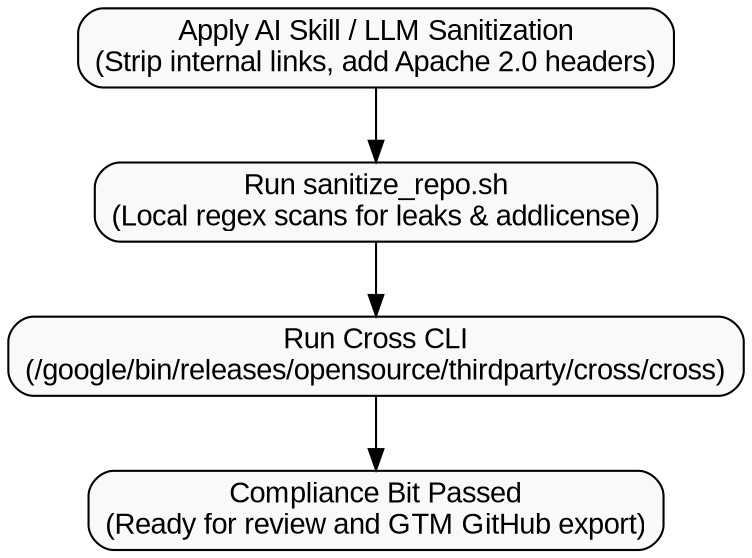

# `fde-cross-compliance` Reference Guide

## Table of Contents
1. [Official OSPO & Compliance Documentation](#1-official-ospo--compliance-documentation)
2. [DOT Verification Workflow Graph](#2-dot-verification-workflow-graph)
3. [Internal Artifact Replacement Matrix](#3-internal-artifact-replacement-matrix)
4. [Third-Party License Policy Matrix](#4-third-party-license-policy-matrix)
5. [Standard Repository Templates](#5-standard-repository-templates)

---

## 1. Official OSPO & Compliance Documentation

- **Releasing Open Source Projects (Google Open Source Docs)**: `https://opensource.google/documentation/reference/releasing`
- **Third-Party Licenses Policy (Google Open Source Docs)**: `https://opensource.google/documentation/reference/thirdparty`
- **Google CLA Portal**: `https://cla.developers.google.com/`
- **`addlicense` Tool Repository**: `https://github.com/google/addlicense`

---

## 2. DOT Verification Workflow Graph

The following Graphviz (`dot`) specification defines the standard compliance pipeline:



---

## 3. Internal Artifact Replacement Matrix

When sanitizing code written inside Google environments, use the following replacements:

| Internal Reference | Public / Client-Safe Replacement |
| :--- | :--- |
| `//depot/google3/...` or `google3/...` | Relative repository path (e.g., `./src/...`) |
| `go/<shortlink>` | Public documentation URL (`https://cloud.google.com/...`) or remove |
| `b/<bug_id>` or `TODO(b/123456)` | `TODO: <description>` (without internal bug number or LDAP) |
| `TODO(username)` or `@google.com` email | `TODO:` (strip individual LDAP/email attribution) |
| Internal `g3doc` documentation URLs | Public Google Cloud or open-source documentation URL |
| Internal `.corp` hostnames/endpoints | Public domain or configurable environment endpoint |
| Hardcoded Project ID (e.g., `my-internal-project`) | `YOUR_PROJECT_ID` (loaded via `os.environ.get("GCP_PROJECT_ID")`) |
| Hardcoded GCS Bucket (e.g., `gs://internal-bucket`) | `gs://YOUR_BUCKET_NAME` (loaded via environment variable) |
| Non-inclusive terms | Use `allowlist` / `denylist` and `primary` / `replica` |

---

## 4. Third-Party License Policy Matrix

Before client delivery, check all dependencies in `package.json`, `requirements.txt`, `pyproject.toml`, `go.mod`, or `pom.xml`:

| License Category | Examples | Action for Client Delivery |
| :--- | :--- | :--- |
| **Permissive (`notice`)** | Apache-2.0, MIT, BSD-2-Clause, BSD-3-Clause, ISC | **Allowed.** Retain copyright notices in lockfiles/distributions. |
| **Weak Copyleft (`reciprocal`)** | LGPL-2.1, LGPL-3.0, MPL-2.0, EPL-2.0 | **Review Required.** Dynamically linked libraries may be acceptable depending on client terms; prefer permissive alternatives. |
| **Strong Copyleft (`restricted`)** | GPL-2.0, GPL-3.0, AGPL-3.0, SSPL | **Prohibited.** Must be removed or replaced before client handoff. |
| **Unlicensed / Proprietary** | Custom internal packages, missing license | **Prohibited.** Replace with open-source or standard GCP SDK equivalents. |

---

## 5. Standard Repository Templates

### `.env.example` Template

```ini
# Google Cloud Configuration
GCP_PROJECT_ID=YOUR_PROJECT_ID
GCP_REGION=us-central1
GCS_BUCKET_NAME=YOUR_BUCKET_NAME

# Optional Service Configuration
PORT=8080
LOG_LEVEL=INFO
```

### Standard Apache 2.0 Header Comment (Python / Shell / YAML)

```python
# Copyright 2026 Google LLC
#
# Licensed under the Apache License, Version 2.0 (the "License");
# you may not use this file except in compliance with the License.
# You may obtain a copy of the License at
#
#     https://www.apache.org/licenses/LICENSE-2.0
#
# Unless required by applicable law or agreed to in writing, software
# distributed under the License is distributed on an "AS IS" BASIS,
# WITHOUT WARRANTIES OR CONDITIONS OF ANY KIND, either express or implied.
# See the License for the specific language governing permissions and
# limitations under the License.
```

### Standard Apache 2.0 Header Comment (JavaScript / TypeScript / Java / Go / C++)

```javascript
/*
 * Copyright 2026 Google LLC
 *
 * Licensed under the Apache License, Version 2.0 (the "License");
 * you may not use this file except in compliance with the License.
 * You may obtain a copy of the License at
 *
 *     https://www.apache.org/licenses/LICENSE-2.0
 *
 * Unless required by applicable law or agreed to in writing, software
 * distributed under the License is distributed on an "AS IS" BASIS,
 * WITHOUT WARRANTIES OR CONDITIONS OF ANY KIND, either express or implied.
 * See the License for the specific language governing permissions and
 * limitations under the License.
 */
```
